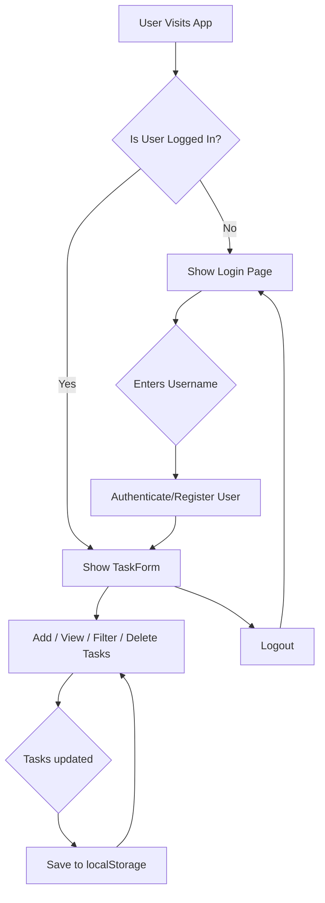

# ✨ Sleek React Task Tracker

> A modern, responsive task management application built with React and Vite, featuring a beautiful glassmorphism UI, smooth animations, and persistent, user-specific storage via the browser's `localStorage`.

## 🚀 Why This Project?

This project was built to demonstrate a clean, modern, and interactive approach to a common web application. It serves as a practical example of how to integrate several powerful frontend technologies to create a polished user experience.

- **Modern UI/UX:** Implements a visually appealing glassmorphism design with fluid animations using Framer Motion.
- **Component-Based Architecture:** Built with React, showcasing a clean separation of concerns using reusable components and custom hooks.
- **User-Specific & Persistent:** Tasks are saved per-user in `localStorage`, so your to-do list is waiting for you when you return.
- **No Backend Needed:** Operates entirely on the client-side, making it easy to deploy and run anywhere.
- **Interactive Elements:** Features dynamic search, filtering, and delete confirmations using Radix UI components for accessibility and great UX.

## 🧰 Tech Stack

- **React** – Core UI library
- **Vite** – Frontend tooling and development server
- **Framer Motion** – Animations and interactive transitions
- **Radix UI** – Accessible, unstyled components for UI primitives (Checkboxes, Dialogs, Selects)
- **CSS Modules & Custom Properties** – For scoped and themeable styling
- **`localStorage`** – For client-side data persistence

## 🛠️ Setup Guide

### 1. 📦 Clone & install dependencies

```bash
# Clone the repository
git clone https://github.com/roxylius/Open-TaskManager.git

# Navigate to the project directory
cd task-tracker

# Install dependencies using npm or bun
npm install
# or
bun install
```

### 2. ▶️ Run the development server

Start the Vite development server by running:

```bash
npm run dev
```

The application will be available at `http://localhost:5173` (or another port if 5173 is in use).

## 📂 Key Components & Directory Tree

The project is organized to separate logic, components, and styles for maintainability.

```
.
├── src/
│   ├── components/         # Reusable React components (Login, TaskForm, TaskList, etc.)
│   ├── hooks/              # Custom hooks for state management (useTasks, useLocalStorage)
│   ├── styles/             # CSS files for styling components
│   ├── App.jsx             # Main application component, handles routing
│   └── main.jsx            # Application entry point
├── .gitignore              # Specifies intentionally untracked files to ignore
├── index.html              # The main HTML file for the Vite app
├── package.json            # Project metadata and dependencies
└── README.md               # This file
```

## 🔁 Application Flow

The application follows a simple, user-centric workflow for managing tasks.

1. **Login/Registration**: A user enters a username. If it's new, they are registered. If it exists, they are logged in. The session is persisted.
2. **Task Management**: Once logged in, the user can add, delete, toggle, and filter their tasks.
3. **Data Persistence**: All tasks are saved to the browser's `localStorage` and are tied to the specific username.
4. **Logout**: The user can log out, which clears the current session and returns them to the login screen.


